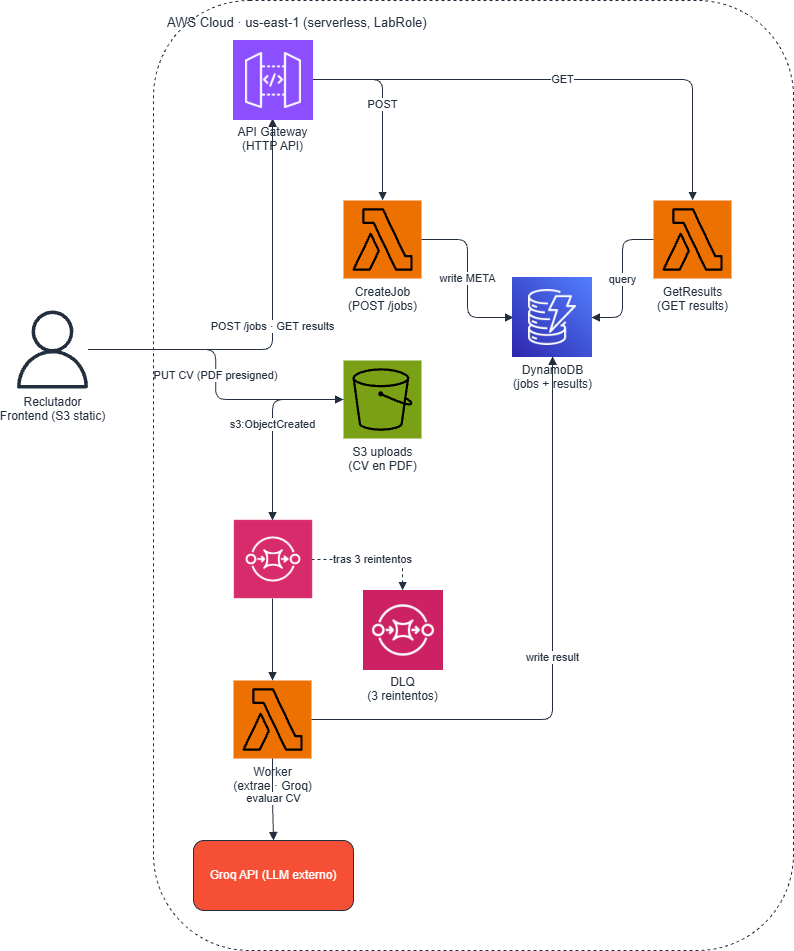

# CV Ranker — Evaluación de CVs con IA, serverless y orientada a eventos

Sistema que lee un lote de CVs en PDF y los **rankea automáticamente** contra una descripción de puesto usando un LLM (Groq). El reclutador sube la vacante + los CVs y recibe, en minutos, un shortlist ordenado por *score* con fortalezas, gaps, seniority y un resumen de cada candidato.

Arquitectura **100% serverless y basada en eventos** sobre AWS, desplegable de forma reproducible en AWS Academy (LabRole).

> Reto Hackathon Cloud — Arquitectura basada en eventos e integración con LLMs.

---

## El problema

Un reclutador recibe entre 50 y 100 CVs por vacante y debe leerlos uno por uno para armar un shortlist. Eso toma horas, es propenso a sesgos y se pasan por alto buenos candidatos. **Nuestra solución** procesa el lote completo en paralelo, evalúa cada CV contra los requisitos del puesto y devuelve un ranking pre-ordenado para que el reclutador entre directo a evaluar a los mejores.

Cada CV se **anonimiza** (se eliminan nombre, email y teléfono) antes de enviarse al modelo, reduciendo el sesgo en la evaluación.

---

## Arquitectura



Flujo de eventos:

1. El reclutador crea la vacante (`POST /jobs`) → **API Gateway** invoca la Lambda **CreateJob**, que guarda la vacante en **DynamoDB** y devuelve *presigned URLs*.
2. El frontend sube cada CV (PDF) **directo a S3** con la presigned URL.
3. Cada carga dispara un evento `s3:ObjectCreated` → un mensaje por CV hacia **SQS**.
4. La Lambda **Worker** consume la cola, extrae el texto del PDF, lo anonimiza, llama a **Groq** y guarda el resultado en **DynamoDB**.
5. Ante un *rate limit* (429) de Groq, el mensaje vuelve a la cola; tras 3 reintentos cae a una **DLQ** sin perder datos.
6. El frontend hace *polling* (`GET /jobs/{id}/results`) y muestra el ranking que se va completando en vivo.

Toda la lógica es asíncrona: el frontend nunca espera bloqueado a que termine el lote.

---

## Stack

| Componente | Servicio AWS |
|---|---|
| Frontend (React) | S3 static website |
| API REST | API Gateway (HTTP API) |
| Orquestación | Lambda (CreateJob, Worker, GetResults) |
| Subida de archivos | S3 + presigned URLs |
| Cola de eventos | SQS (1 mensaje por CV) + DLQ |
| Persistencia | DynamoDB (single-table) |
| LLM | Groq API (externo) |
| Infraestructura | CloudFormation (sin recursos IAM, usa LabRole) |

---

## Demo en vivo

- **Frontend desplegado:** `⬜ <URL pública del bucket S3>`
- **Video demo (YouTube):** `⬜ <link del video>`

> Reemplazar los placeholders al cerrar el despliegue público y subir el video.

---

## Estructura del repositorio

```
cv-ranker-cloud/
├── README.md                 # este archivo
├── docs/
│   ├── contexto.md           # problema, casos de uso e impacto
│   ├── despliegue.md         # manual de despliegue paso a paso (LabRole)
│   ├── arquitectura.drawio   # fuente editable del diagrama
│   └── arquitectura.png      # diagrama exportado
├── infra/
│   └── template.yaml         # CloudFormation: S3, SQS+DLQ, DynamoDB, API Gateway, Lambdas
├── backend/                  # código de las Lambdas (CreateJob, Worker, GetResults)
├── frontend/                 # app React (formulario + ranking)
└── data/
    └── cvs_dummy/            # 28 CVs de prueba en PDF + manifest
```

Repos por componente: [backend](https://github.com/RafaCH1906/Back_read_CV) · [frontend](https://github.com/AE00NN/Frontend-Hackathon-CC)

---

## Contrato de la API

**`POST /jobs`** — crea la vacante y devuelve las URLs de subida.

```jsonc
// request
{
  "job_title": "Backend Developer",
  "required_skills": ["python", "aws", "sql", "docker"],
  "years_experience": 3,
  "cv_count": 28
}
// response 201
{
  "job_id": "3bf0c587...",
  "upload_urls": [
    { "cv_id": "4ca7...", "presigned_url": "https://...", "s3_key": "jobs/.../cvs/4ca7....pdf" }
  ],
  "expires_in_seconds": 900
}
```

**Subir cada CV** — `PUT` a la `presigned_url`. Reglas obligatorias:
- El archivo debe ser un **PDF real**.
- El request debe incluir el header `Content-Type: application/pdf`.
- La URL expira en 15 minutos.

**`GET /jobs/{id}/results`** — ranking ordenado por score (descendente).

```jsonc
{
  "job": { "job_title": "...", "required_skills": ["..."], "status": "...", "...": "..." },
  "results": [
    {
      "cv_id": "...", "score": 98, "seniority": "Senior",
      "strengths": ["..."], "gaps": ["..."], "summary": "...",
      "soft_skills_note": "...", "confidence_flag": "...", "status": "completed"
    }
  ],
  "total": 28
}
```

Modelo de datos en DynamoDB (single-table): `PK = job_id`, `SK = "META"` para la vacante y `SK = "CV#<cv_id>"` para cada resultado.

---

## Despliegue rápido

> Manual completo y detallado en [`docs/despliegue.md`](docs/despliegue.md).

Pensado para **AWS Academy Learner Lab** (us-east-1). No crea roles IAM: usa el `LabRole` existente como execution role, por lo que es reproducible en la misma cuenta que tendrá el evaluador.

```bash
# 1. Iniciar el lab y abrir CloudShell (us-east-1)
export AWS_DEFAULT_REGION=us-east-1

# 2. Backend: empaquetar y desplegar
python build_package.py                    # genera los ZIP de las Lambdas
aws cloudformation deploy \
  --template-file infra/template.yaml \
  --stack-name cv-ranker \
  --parameter-overrides GroqApiKey=<TU_API_KEY_GROQ>

# 3. Ver las salidas (API endpoint, buckets, etc.)
aws cloudformation describe-stacks --stack-name cv-ranker \
  --query "Stacks[0].Outputs" --output table

# 4. Frontend: build apuntando a la API y subir a S3
#    (configurar la URL del API en el .env del frontend antes del build)
npm --prefix frontend run build
aws s3 sync frontend/dist s3://cv-frontend-<ACCOUNT_ID>
```

La URL pública es la del bucket de frontend: `http://cv-frontend-<ACCOUNT_ID>.s3-website-us-east-1.amazonaws.com`.

---

## Probar la solución

En `data/cvs_dummy/` hay **28 CVs de prueba en PDF** diseñados para producir un ranking claro, más un `_manifest.csv` con el fit esperado de cada uno.

Configuración de la vacante para la demo:

| Campo | Valor |
|---|---|
| Título | `Backend Developer` |
| Skills | `python, aws, sql, docker` |
| Años de experiencia | `3` |

Con esa vacante, los perfiles backend con Python/AWS deben quedar arriba (~75-98) y los fuera de perfil (marketing, contabilidad, etc.) al fondo (~0-25). El `_manifest.csv` permite verificar que el ranking real coincide con el esperado.

---

## Resiliencia y manejo de límites (LLM)

- **Procesamiento por lotes** controlado: un mensaje SQS por CV, consumidos en paralelo de forma asíncrona.
- **Reintentos automáticos:** ante errores de Groq (429 / transitorios) el Worker relanza la excepción; SQS reintenta vía *visibility timeout*.
- **Sin pérdida de datos:** tras 3 intentos fallidos el mensaje cae a una **Dead Letter Queue**.
- **Validación:** las respuestas del LLM se validan con un esquema estricto antes de persistirse.

---

## Equipo

| Rol | Responsable | Componente |
|---|---|---|
| Backend / procesamiento | P1 | Lambdas, integración Groq, infra |
| Frontend | P2 | App React, UX del ranking |
| Infraestructura / integración / docs | P3 | CloudFormation, diagrama, manual, integración |

---

## Cobertura de la rúbrica

1. **Contexto e impacto** → [`docs/contexto.md`](docs/contexto.md)
2. **Diagrama de arquitectura** → [`docs/arquitectura.png`](docs/arquitectura.png)
3. **Resiliencia / límites / LLM** → SQS + DLQ + manejo de 429 (ver sección anterior)
4. **Frontend desplegado** → URL pública (arriba)
5. **Repositorio y despliegue** → este repo + [`docs/despliegue.md`](docs/despliegue.md)
